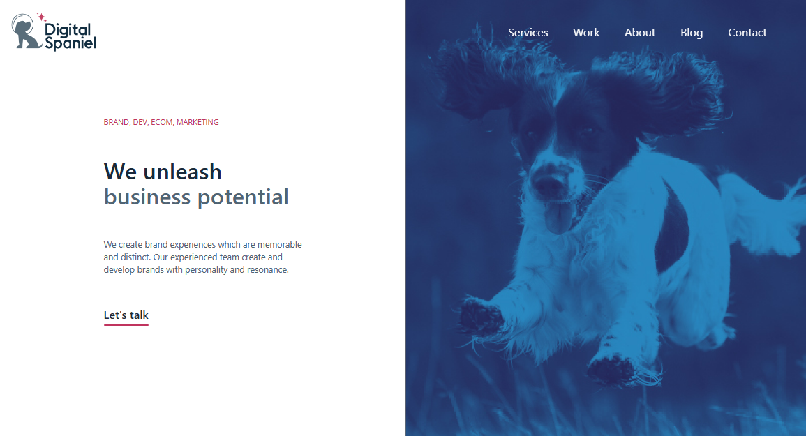

# Digital Agency Landing – React + Tailwind



A responsive landing page built with React and Tailwind CSS.  
It features a sticky auto-hiding header, hover/active navigation states, a mobile slide-in menu, link hover animations, and interactive sections.

**Live Demo:** [Live Here](https://digital-spaniel-001.netlify.app/)

---

## ✨ Features

- **Sticky, auto-hiding header** – hides on scroll down and reappears on scroll up.
- **Navigation with states** – hover / active / visited states for all menu items.
- **Mobile-first design** – collapses into a hamburger style menu that slides in/out.
- **Animated links** – e.g., “Let’s talk” underline animation.
- **Interactive “Capable Of” section** – hover effect on **Brand Strategy**.
- **Accessible** – focus styles, ARIA roles, and keyboard support.

---

## 🧱 Tech Stack

- [React](https://react.dev/)
- [Tailwind CSS](https://tailwindcss.com/)
- [React Router DOM](https://reactrouter.com/)
- [React Icons](https://react-icons.github.io/react-icons/) / [Lucide-react](https://lucide.dev/)
- [Framer Motion](https://www.framer.com/motion/)


---

## 🚀 Getting Started

Clone the repository and install dependencies:

```bash
# Clone
git clone https://github.com/pronoyNath/PEN_Task.git
cd your-repo-name

# Install dependencies
npm install

# Start dev server
npm run dev   # if Vite
# or
npm start     # if CRA

# Build for production
npm run build

# Preview production build (Vite only)
npm run preview
